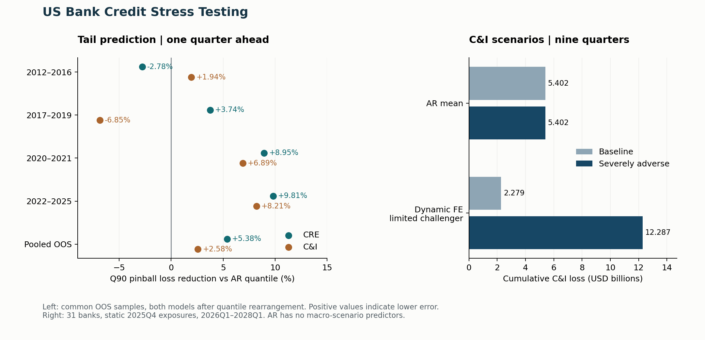

# US Bank Credit Stress Testing

**Call Report data engineering · Panel econometrics · Tail-risk evaluation · Federal Reserve stress scenarios**

## Abstract

How much do bank fundamentals and macroeconomic conditions add to persistent credit-loss dynamics, and how can those estimates inform portfolio risk under stress? I built a bank–segment–quarter panel from public regulatory filings, compared dynamic fixed-effects and quantile models with autoregressive benchmarks, and translated official scenarios into nine-quarter C&I loss projections. A hierarchical Bayesian Student-t model is implemented as an extension; validated posterior results are not part of the reported findings.

The historical panel contains **8,145 observations across 33 banks, three loan segments, and 84 quarters (2005–2025)**, supported by **73 distinct mapped Call Report codes**. Pooled out-of-sample CRE Q90 pinball loss is **5.38% lower** than the AR quantile benchmark after quantile rearrangement. The C&I stress exercise covers **31 banks over 2026Q1–2028Q1**.

[Data definitions](docs/data.md) · [Numerical evidence](results/summary.json) · [Reproduction guide](docs/reproduction.md) · [Source code](src/bankstress)

## 1. Economic rationale and research questions

Credit losses connect borrower repayment capacity, collateral values, and portfolio composition. GDP, unemployment, financing spreads, and rates are candidate predictors of C&I losses; CRE prices are a candidate collateral-cycle indicator. Lagged losses capture persistence, while bank effects capture stable differences in lending portfolios and underwriting. These mechanisms motivate testable predictors; regression coefficients alone do not establish causality.

I separate three questions:

1. **Expected loss:** do lagged bank controls and macro variables improve out-of-sample mean forecasts beyond an AR model with bank effects?
2. **Tail risk:** does a dynamic quantile model improve prediction of unusually high quarterly loss rates against an AR model at the same quantile?
3. **Stress exposure:** what losses follow if the modeled relationship is applied recursively to baseline and severely adverse macro paths?

Quantile regression estimates conditional quantiles rather than only the mean, motivating a separate tail-error objective. See [Koenker and Hallock (2001)](https://pubs.aeaweb.org/doi/10.1257/jep.15.4.143). The stress exercise uses the [Federal Reserve's final 2026 scenarios](https://www.federalreserve.gov/publications/2026-stress-test-scenarios.htm) as conditional macroeconomic inputs, not as forecasts or probabilities.

## 2. Data collection and panel construction

| Component | What I constructed | Inspect the work |
| --- | --- | --- |
| Regulatory collection | Quarterly FFIEC archives, download manifests, SHA-256 checks, source-file lineage | [Downloader](src/bankstress/io/ffiec.py), [84-quarter manifest](data/manifests/ffiec_manifest.csv) |
| Field harmonization | 73 raw codes with effective dates, filing forms, stock/flow types, units, source references | [Field mapping](metadata/field_mapping.csv), [evidence](metadata/field_mapping_evidence.csv) |
| Bank sample | Regulatory identifiers, parent names, business-model exclusions, merger history | [Institutions](metadata/institutions.csv), [lineage](metadata/institution_lineage.csv) |
| Portfolio panel | CRE, C&I, and closed-end mortgage exposures and quarterly charge-offs/recoveries | [Standardization](src/bankstress/transform/standardize.py), [panel](src/bankstress/transform/panel.py) |
| Macro alignment | FRED/ALFRED series and FDIC noncurrent-loan controls aligned to the forecast information set | [Macro pipeline](src/bankstress/macro.py), [configuration](configs/macro_series.yaml) |
| Quality assurance | Gross-flow reconciliation, capital-ratio checks, 100-observation archive-to-panel audit | [QA](src/bankstress/qa/report.py), [source audit](metadata/manual_source_audit.csv) |

The engineering challenge is maintaining comparable definitions across time. I map the CRE reporting taxonomy change, distinguish domestic and consolidated filings, and require complete component sets before publishing segment totals. Missing or unsupported disclosures remain missing. YTD charge-offs and recoveries are differenced only within a calendar year and across adjacent quarters with the same reporting scope; Q1 starts the annual flow sequence.

The modeled target is the **annualized net charge-off rate**, in decimal units:

$$
y_{i,s,t}=4\frac{\mathrm{ChargeOff}_{i,s,t}-\mathrm{Recovery}_{i,s,t}}{(\mathrm{Loans}_{i,s,t}+\mathrm{Loans}_{i,s,t-1})/2}.
$$

Negative observed net charge-offs are retained. Historical coverage and model eligibility are separate: 8,145 panel rows do not imply 8,145 scored forecasts. The unit is the reporting bank, not a consolidated bank holding company. [Full definitions and limitations →](docs/data.md)

## 3. Empirical design

### Models and estimands

The dynamic mean specification adds origin-known controls to an AR benchmark:

$$
y_{i,s,t}=\alpha_{i,s}+\rho_s y_{i,s,t-1}+\beta_s^{\prime}X_{i,t-1}+\gamma_s^{\prime}M^{\mathrm{available}}_{t-1}+\varepsilon_{i,s,t}.
$$

Bank controls include noncurrent loans, allowance coverage, loan growth, and the Tier 1 ratio. Macro predictors vary by segment. The implementation treats data availability explicitly; the lag notation above summarizes the information set.

| Method | Research role | Evaluation / status |
| --- | --- | --- |
| AR with bank effects | Persistence benchmark | RMSE, MAE, bias on common scoring keys |
| Dynamic fixed effects | Incremental bank and macro information | Bank-clustered uncertainty; split-panel jackknife diagnostic; C&I stress challenger |
| Dynamic quantile regression, Q50/Q75/Q90 | Conditional loss-rate tail | Pinball loss, exceedance rates, crossing; AR quantile benchmark |
| Hierarchical Bayesian Student-t | Partial pooling across bank–segment intercepts, segment-specific slopes, heavy-tailed errors | PyMC implementation; sampling skipped in the retained run; no validated posterior claim |

The Bayesian specification uses non-centered varying intercepts and explicit priors, seeds, and convergence thresholds. The code demonstrates the method; the [diagnostic record](results/evidence/bayesian_diagnostics.csv) states why no posterior estimates enter the result tables.

### Time-based evaluation

| Training period | Held-out period | Context |
| --- | --- | --- |
| 2005–2011 | 2012–2016 | Post-crisis recovery |
| 2005–2016 | 2017–2019 | Pre-pandemic expansion |
| 2005–2019 | 2020–2021 | Pandemic period |
| 2005–2021 | 2022–2025 | Higher-rate / CRE adjustment |

I use expanding training windows rather than random splits. Comparisons share bank, segment, forecast-origin, and target-quarter keys. Unavailable targets affect scoring, not whether a forecast can be generated. Separate historical stress checks freeze bank controls at the jump-off quarter and use realized macro paths to diagnose recursive behavior.

For Q90, error is pinball loss with $\rho_{0.9}(u)=u(0.9-\mathbf{1}\{u<0\})$; underprediction receives greater weight. Independently fitted quantiles are rearranged into order, with original and rearranged scores retained. The headline comparison uses the latter for **both** models. [Model specifications →](configs/model_specs.yaml)

## 4. Results



### Tail forecasting: approximately 5% improvement, with a precise scope

| Pooled OOS Q90, 2012–2025 | Scored bank-quarters | AR quantile pinball loss | Dynamic quantile pinball loss | Relative reduction |
| --- | ---: | ---: | ---: | ---: |
| **CRE** | **1,264** | **0.000617234** | **0.000584014** | **5.38%** |
| C&I | 1,525 | 0.001393469 | 0.001357524 | 2.58% |

Reduction is $1-\mathrm{Loss}_{dynamic}/\mathrm{Loss}_{AR}$, computed from pooled observation-level errors, not an unweighted average of window improvements. [Exact scores, counts, and all windows →](results/evidence/tail_metrics.csv)

CRE improvement ranges from **−2.78% to +9.81%** across the four windows. Pooled CRE Q90 exceedance is **8.62%**, versus nominal 10%; independently fitted quantiles crossed in **507** instances across model families and windows before rearrangement. These are point estimates and calibration diagnostics; no statistical-significance claim is made for the gain. This is a **one-quarter CRE tail-rate result**, not a nine-quarter cumulative-loss quantile.

### Mean forecasting: complexity does not consistently beat persistence

Dynamic FE lowers equal-observation RMSE in **1 of 8** segment–window comparisons. I retain AR as the mean benchmark and use dynamic FE C&I as a limited stress challenger. Tail-score improvement does not establish mean-model superiority. [Complete comparison →](results/evidence/mean_model_comparison.csv)

### Nine-quarter C&I stress projections

Starting from 2025Q4 exposures, I recursively project annualized loss rates for 2026Q1–2028Q1, hold exposures and bank controls fixed, and accumulate quarterly dollar losses as $\max(\widehat y_t,0)\times\mathrm{Loans}_{2025Q4}/4$.

| C&I only; 31 banks; USD billions | Baseline | Severely adverse |
| --- | ---: | ---: |
| AR mean benchmark | 5.402 | 5.402 |
| Dynamic FE limited challenger | 2.279 | 12.287 |

AR has no macro-scenario predictors, so its identical scenario totals are a model limitation. The dynamic FE difference illustrates modeled sensitivity under a static balance sheet; it does not validate those projections as future realized losses. Dollar totals use the retained unrounded bank-level summary. [Bank-level evidence →](results/evidence/stress_by_bank.csv)

## 5. Credit-risk interpretation and conclusions

The contribution is a traceable path from public filings to comparable credit outcomes, defensible out-of-sample comparisons, and interpretable scenario losses. The tail model adds modest predictive information for CRE, while mean-model results show why a risk framework needs a strong persistence benchmark and model-use limits.

**Exposure concentration and loss-rate amplification are different mechanisms.** A larger CRE book produces more dollar losses at the same loss rate. A separate bank- and quarter-effects interaction study tests whether CRE exposure amplifies the per-dollar loss response to contemporaneous CRE price growth. Its estimate is −5.99e−6, with a 95% interval of [−3.17e−5, 1.97e−5]; this does not establish an additional amplification effect. The shock is explicitly ex-post information in this explanatory analysis. [Coefficients →](results/evidence/cre_interaction.csv)

**Credit-loss burden is not capital depletion.** Cumulative modeled losses divided by starting Tier 1 provide an exposure-to-capital comparison. A capital forecast would additionally require earnings, provisions, taxes, distributions, and RWA dynamics. Mortgage stress, validated Bayesian stress, and multi-period tail-loss distributions are outside the reported evidence.

Other limitations include a selected regional-bank sample, unsupported historical filing detail, two bounded gross-flow reconciliation review items, and some final-vintage macro fallbacks. These constrain real-time and population-wide interpretation; see [data notes](docs/data.md).

## 6. Reproduce and inspect

Python 3.11 or newer:

```bash
python -m venv .venv
# Activate .venv for your shell, then:
python -m pip install -e ".[test]"
python scripts/export_results.py --verify
python scripts/plot_results.py
python -m pytest -q -p no:cacheprovider
```

This verifies committed evidence and recalculates the display without downloading data or refitting models. Full analytical replay requires additional manifest-backed inputs; see the [reproduction guide](docs/reproduction.md).

```text
configs/        Data, model, and scenario specifications
data/manifests/ Download provenance; bulk data stay local and ignored
metadata/       Field definitions, sample, lineage, source audits
src/bankstress/ Collection, transformations, models, validation, stress
scripts/        Function-named entry points and result verification
tests/          Data, timing, scoring, and model-use regression checks
results/        Selected evidence, provenance, summary, figure
docs/           Data definitions and reproduction instructions
```
